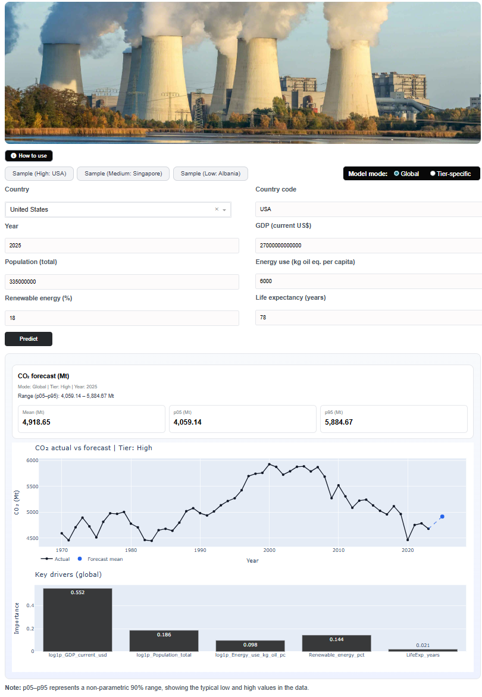

## 🌍 CO₂ Emissions Forecasting Project

This project provides an interactive dashboard for analyzing and forecasting **CO₂ emissions by country** using machine learning models trained on the **World Bank — World Development Indicators (WDI)** dataset. 🔗 https://databank.worldbank.org/source/world-development-indicators

---

## 🏠 Home Overview

The homepage of the app presents:

### 🔹 **1. Interactive Input Panel**
Users can input:
- Country
- Year
- GDP (current US$)
- Population
- Energy use (kg oil eq. per capita)
- Renewable energy (%)
- Life expectancy  
and choose between:
- **Global model**
- **Tier-specific model**

There are also sample buttons for quickly loading pre-filled example countries such as **USA**, **Singapore**, and **Albania**.

### 🔹 **2. Forecast Results**
The system outputs:
- Predicted CO₂ emissions (mean)
- p05–p95 range (non-parametric 90% interval)
- Tier classification (High / Medium / Low)

### 🔹 **3. Visualizations**
The dashboard automatically generates:
- CO₂ Actual vs Forecast Line Chart  
- Feature Importance Chart (key drivers)

---

## 🌐 Web Demo Preview

Here is an example of the interactive forecasting web application:

The dashboard allows users to:
- Select country inputs  
- Choose model mode (Global or Tier-specific)  
- View CO₂ forecast with confidence range  
- Compare historical vs. predicted CO₂  
- Inspect key drivers from the model  

